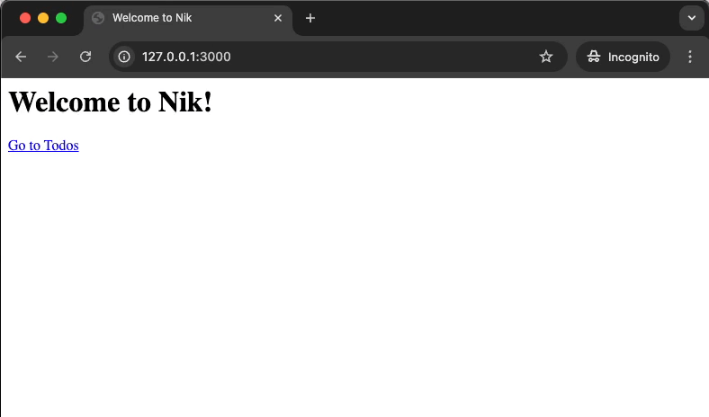

# Quick Start

This guide will walk you through setting up a new Nik project.

### Project Setup

First, create a new directory for your project and set up a virtual environment. We'll use `uv` in this guide.

```bash
uv init my-nik-app
cd my-nik-app
```

### Dependencies

Next, install `nik` and `uvicorn`. Since Nik is an ASGI framework, you need an ASGI server like `uvicorn` to run your application.

```bash
uv add nik uvicorn
```

This will install a virtual environment for your project and add the dependencies to it. To activate the virtual environment, run:

```bash
source .venv/bin/activate
```

### Application Entrypoint

Create a `main.py` file in your project's root directory. This file will initialize your Nik application.

```python title="main.py"
from nik import Nik

app = Nik()
```

### Create a Layout

Nik supports layouts, which allow you to define a shared HTML structure for your pages. Let's create a root layout at `app/routes/layout.py`.

```python title="app/routes/layout.py"
from nik.views.elements import Body, Children, Head, Html, Title


def layout(children: Children):
    return Html(
        Head(
            Title("Welcome to Nik"),
        ),
        Body(
            children,
        ),
    )
```

??? tip

    Noticed the `children` parameter in the layout function? Nik supports nested layouts, and views that eventually composes your final view tree. The `children` parameter is basically a reference to the previous view, in this case the route view itself which we will create next.

### Create Routes

Nik supports file-based routing. It scans your `app/routes` directory for `route.py` modules. The path to the `route.py` file determines the URL. For example:

- `app/routes/route.py` maps to `/`
- `app/routes/todos/route.py` maps to `/todos`
- `app/routes/todos/_id_/route.py` maps to `/todos/:id` where `_id_` is a special notation for dynamic segments.

Let's now create these routes.

=== "app/routes/route.py"

    ```python
    from nik.views.elements import H1, A, Div


    def view():
        return Div(
            H1("Welcome to Nik!"),
            Div(
                A("Go to Todos", href="/todos"),
            ),
        )
    ```

=== "app/routes/todos/route.py"

    ```python
    from nik.views.elements import H1, A, Div, Li, Ul


    def view():
        return Div(
            H1("Todos"),
            Ul(
                Li(A("Todo 1", href="/todos/1")),
                Li(A("Todo 2", href="/todos/2")),
                Li(A("Todo 3", href="/todos/3")),
            ),
        )
    ```

=== "app/routes/todos/\_id\_/route.py"

    ```python
    from nik.views.elements import H1, A, Div


    def view(id: str):
        return Div(
            H1(f"Todo {id}"),
            A("Back to Todos", href="/todos"),
        )
    ```

    The `id` dynamic route parameter will be automatically injected to your view function.

### Run the Server

Now, run the application using `uvicorn`.

```bash
uvicorn main:app --reload
```

The `--reload` flag tells `uvicorn` to automatically restart the server when you make changes to your code.

Uvicorn by default will run the server on port `3000`, if you already have an app running on that port, you can specify a different port using the `--port` flag.

??? info

    Have you noticed a `_routesgen.py` module showing up under `app` directory? This module is automatically generated by Nik and contains all the route definitions for your application.

    We recommend including this module in your version control system such as Git.

### Browse the app

You can now browse your app at `http://127.0.0.1:3000/`.

As you navigate through the links you will notice Nik already acts like a single-page application (SPA). By default, Nik intercepts internal links and only loads the part of the page that changes between requests.



!!! info

    If you haven't already done yet, open your browser's developer tools and check the network requests as you navigate through the app. You will see how Nik loads only the necessary parts of the page, making your app feel fast and responsive.

Congratulations! You have successfully created and run your first Nik application!
